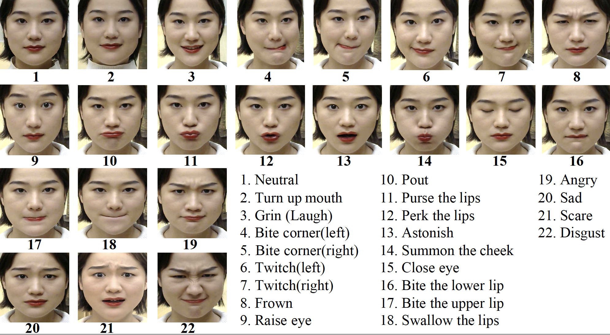

# Pixel-Face Dataset  

## Introduction  
We present a large-scale, high-resolution and diverse 3D face dataset, PixelFace, with massive annotations. PixelFace contains a training set with 655 subjects and a validation set with 200 subjects. Each subject has samples under different expressions and multiple views. Each sample provide synchronized multi-view 2D face image, depth(will release in the future), 3D scanning and registration results.There are 8483 samples totally.
The 3D landmarks, age and gender of the subjects are also included. The data have been released to public for non-commercial research purpose.
	 


## Data Downloading  
Please send emails to pixel.face.data@gmail with signed [agreement](agreement.docx) to obtain the download link and password. The whole dataset is about 50GB.     


## Data Description
The available data includes the following.
### 1. information
Download the **Dataset Information** to get folder **release_id/**  
<br>

* release\_id/split/release\_eva.txt and release\_id/split/release\_train.txt  

	The text files containing name of samples for evaluation and training.
	
* release\_id/release_id.txt  
	ids of all data samples

	
* release\_id/release_info.txt

	A text file containing the ages and gender of the subjects. From left to right, each row is the subject, data id, gender (1-male, 0-female), age, and expression label whose detailed definitions are shown in Fig1 (label  0 indicating arbitrary expression which is not defined).
	
	 
	
	
## 2. Multi-modality Data

There are 8483 multi-modality samples. Each sample consists of: 

1. multi-view 2D images (sample/$VIEW$/t.bmp), the $VIEW$ 0, 1, 2 refer to left, middle, right respectively.
2. 3D scanning and registration results (sample/fusion/gt.mat)
3. multi-view depth (sample/$VIEW$/depth.bmp)

## 3. Tools 
We provide Python3.6 code to extract facial landmarks and obj from the mat file. The instructions of basic setup are:

* Install basic requirements:

```
	pip install -r requirement.txt 
```  

* Run the following command will extract sample data from .mat and generate .obj files for face meshes. You can follow the same practice to extract other data after downloading.  
```
	python util/read_data.py
```	

* If you have problem in visualize the generated obj files. Please run the following command to convert the color space. It might be helpful.  
```
	python util/convert_obj.py
```
